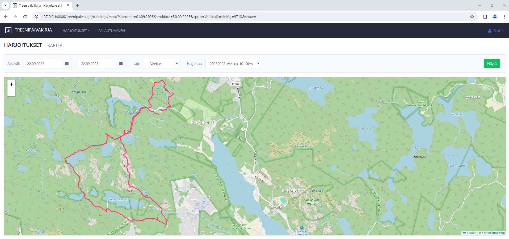

# Training Diary App #

Web application for tracking and analyzing trainings. 

Training and recovery data can be uploaded from [Polar](https://www.polar.com/en/accesslink) and [Oura](https://cloud.ouraring.com/docs/).

## Features ##

### Keep track of your trainings

* Input your trainings 
    * either manually or load them through Polar API
* Investigate training calendar
* Download training data into excel or csv


### Analyze your trainings

* Analyze your trainings with various graphical reports


### View routes on map

* View training routes on map



### Follow your recovery

* Fetch sleep data from Polar or Oura
* Analyze it with recovery dashboard


### Personalize settings

* Sports, training zones and seasons can be customized for each user


## Setting up the development environment ##

* Install Python >= 3.10

* Clone repository

* Install required python libraries

````
pip install -r requirements.txt
````

* Run database migrations

````
python .\treenit\manage.py migrate
````

* Import static data

````
python .\treenit\manage.py loaddata treenit\treenipaivakirja\fixtures\aika.json
````

* Set following environment variables 
````
DEBUG = True
SECRET_KEY = your_secret_key
````

* If you wish to interact with Polar and Oura APIs set also following environment variables
````
ACCESSLINK_CLIENT_KEY
ACCESSLINK_CLIENT_SECRET
OURA_CLIENT_KEY
OURA_CLIENT_SECRET
````

* Start app by running following command
````
python .\treenit\manage.py runserver
````

* Open web-browser (*preferred Chrome*) and go to
````
http://127.0.0.1:8000/treenipaivakirja/
````